# Control and Trajectory Tracking for Autonomous Vehicle

In this project, you will apply the skills you have acquired in this course to design a Proportional-Integral-Derivative (PID) controller to perform vehicle trajectory tracking. Given a trajectory as an array of locations and a simulation environment, you will design and code a PID controller and test its efficiency on the CARLA simulator used in the industry.

## Dependency - Udacity VM Workspace
The state code in this repository is aligned to run on the Udacity VM workspace. Refer to the classroom page **Ubuntu VM Workspace - Overview** to learn how to access the VM workspace and its restrictions and best practices. 

However, to set up your local machine with the necessary tools, you must have either *Windows Subsystem for Linux* (WSL) or *Ubuntu 20.04* or *18.04 LTS*. Below is the list of tools installed in the Udacity VM workspace that you should install on your local machine. (Refer README.md file in the base repository: https://github.com/udacity/nd013-c6-control-starter.git)

# Instructions
The sections ahead will guide you through the steps to build and run the project using VM workspace. 

## Step 1. Log into VM Workspace

Open the VM workspace and log into the VM to practice the current project. 
Once you log into the VM, open a Terminal window. 


## Step 2. Clone the Repository

Fork the repository to your Github account and clone the repository to the workspace using the commands below. 

```bash
git clone https://github.com/udacity/nd013-c6-control-starter.git
```

Change to the project directory.
```bash
cd nd013-c6-control-starter/project
```

## Step 3. Review the starter files
You will find the following files in the project directory.

```bash
.
├── cserver_dir
├── install-ubuntu.sh
├── manual_control.py
├── pid_controller/     # TODO Files
├── plot_pid.py
├── run_main_pid.sh
├── simulatorAPI.py
├── steer_pid_data.txt
└── throttle_pid_data.txt
```
※ Base repository has no run_carla.sh file so you should use the file from **Motion Planning and Decision Making for Autonomous Vehicles**

## Step 4. Start the Carla Server
Start the Carla server by executing the following shell script. 
```bash
./run_carla.sh
```
This file will, in turn, execute the **/opt/carla-simulator/CarlaUE4.sh** script. 


## Step 5. Install Dependencies
Open another Terminal tab, and change to the **nd013-c6-control-starter/project**  directory. Execute the following shell script to install the project-specific dependencies. 
```bash
./install-ubuntu.sh
```
This file will install utilities such as, `libuv1-dev`, `libssl-dev`, `libz-dev`, `uWebSockets`.

※ Sometime you maybe face with error in this step, you should reset the VM workspace and try again from the begining.

## Step 6. Update the Project Code

Change to the **pid_controller/** directory.
```bash
cd pid_controller/
```
Before you start coding, we strongly recommend you look at the rubric in your classroom, against which the human Mentor will review your submission. Your submission must satisfy all rubric criteria to pass the project; otherwise, the Mentor may ask you to re-submit. 


Update the following files as per the classroom instructions. You will TODO markers as well in these files. 

- **pid_controller.h**
- **pid_controller.cpp**
- **main.cpp**

> **Important**: At this moment, it is important to save your work and push it back to the remote Github repository. 

### Update Notes
In the previous version of the project starter code, we had **libcarla-install/** and **rpclib/** directories inside the **pid_controller/** directory. But, those directories are no longer needed in the current version of the starter code because the current **CMakeLists.txt** file has corresponding `includes` and `libs` added at `/opt/carla-source`.

To give some old context, when we had **rpclib/** directory inside the starter files, we used to compile the **rpclib** library using the following commands. 
```bash
cd pid_controller/
rm -rf rpclib
git clone https://github.com/rpclib/rpclib.git
```
This library is a **msgpack-rpc** library written using modern C++. The goal of building this library was to provide a simple RPC solution. However, all of the above-mentioned steps are **no longer needed** in the current version of the project strarter code. 

## Step 7. Build and Execute the Project

When you finish updating the project files, you can execute the project using the commands below. 

```bash
# Build the project
# Run the following commands from the pid_controller/ directory
cmake .
# The command below compiles your c++ code. Run it after each time you edit the CPP or Header files
make
```

```bash
# Run the project
cd ..
# Run the following commands from the nd013-c6-control-starter/project directory
./run_main_pid.sh
```
If the execution fails silently, you can use **ctrl + C** to stop, and try again. 
※ Or you must restart the carla simulation

Another possible error you may get is `bind failed. Error: Address already in use`. In such a case, you can kill the process occupying the required port using the commands below. You also should restart carla simulation to remove the old cars from the previous running

```bash
ps -aux | grep carla
# Use the IDs displayed in the output of the last command. 
kill id     
```

#### You can use Ctrl + C to stop running the simulation. The values of the error and the pid command are saved in thottle_data.txt and steer_data.txt. Plot the saved values using the command:
```bash
# Run the command in the "project" folder
python3 plot_pid.py
```

You might need to install a few additional Python modules:
```bash
pip3 install pandas
pip3 install matplotlib
```

## Step 8. Check the Rubric and Submit

Re-check the rubric in the classroom and ensure that your submission satisfies all rubric criteria to pass the project. Once you are confident, submit the project. 

# The result

I built the steer and throttle controller so that the car follows the trajectory by updating the following files as per the classroom instructions. You will TODO markers as well in these files. 

- **pid_controller.h**
- **pid_controller.cpp**
- **main.cpp**

### Step 1: Build the PID controller object
Complete the TODO in the [pid_controller.h]() and [pid_controller.cpp](https://github.com/udacity/nd013-c6-control-starter/blob/master/project/pid_controller/pid_controller.cpp).

Run the simulator and see the desktop mode of the car in the CARLA simulator. Take a screenshot and add it to your report. The car should not move in the simulation.
This result is shown in the image below and the car not moving

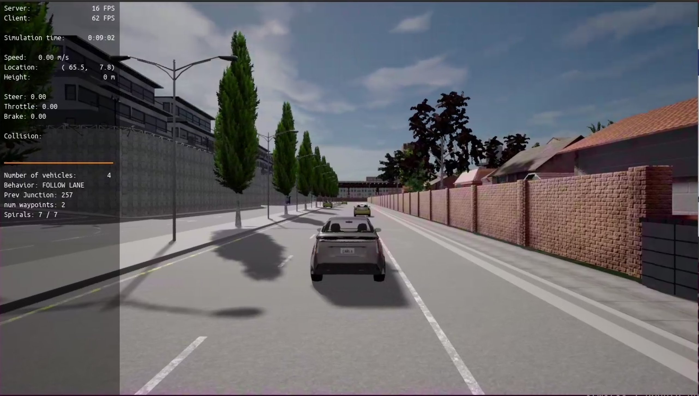

### Step 2: PID controller for throttle:
The last point of the vector v_points and current velocity were used to calculate the velocity error. After some experimenting and fine-tuning, the PID coefficients were set to kp = 0.20, ki = 0.05, kd = 0.1, and output was limited to [-1, 1]

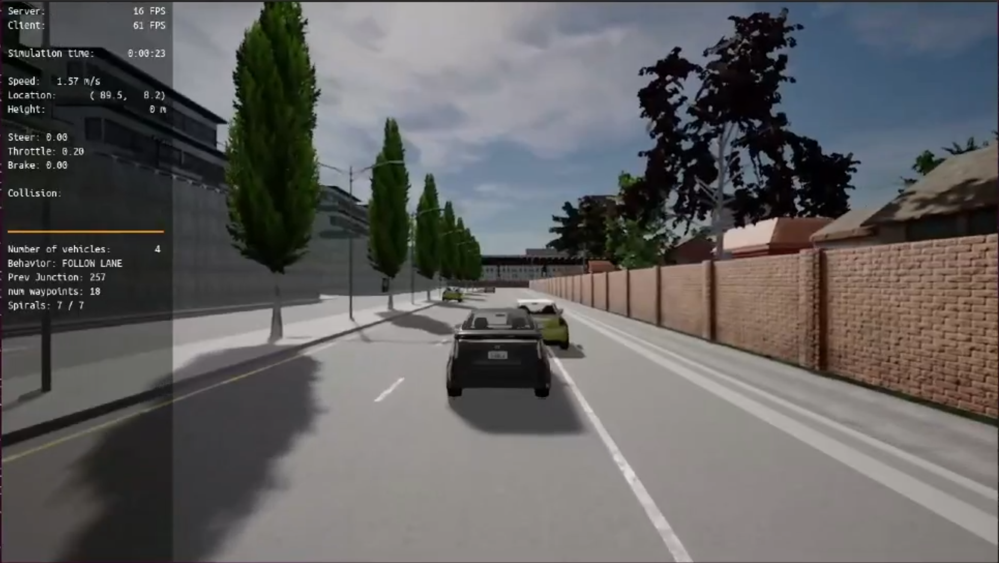

I also tried to use the closest point replace for the last point of v_points to calculate but the result was the same.

### Step 3: PID controller for steer:
The error between the actual steer and the desired steer was calculated and the coefficients for the PID controller were tuned. The final values were as below: kp = 0.35, ki = 0.0012, kd = 0.9 and output limited to [-1.2, 1.2]
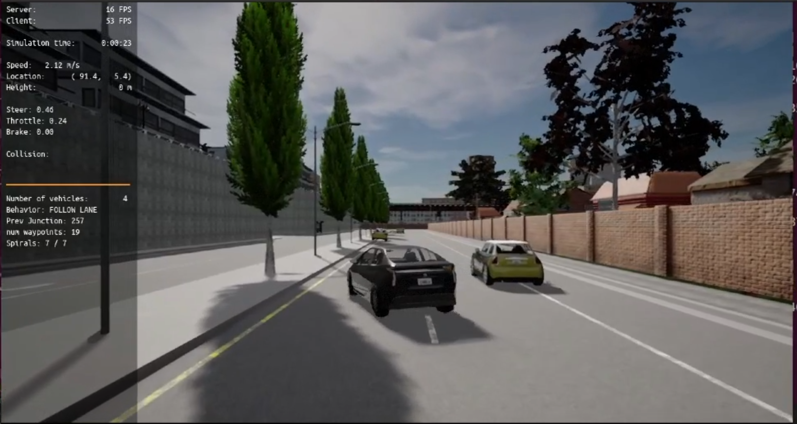

I also tried to use the closest point to replace for last point of v_points to calculate but the result was the same.

### Step 4: Evaluate the PID efficiency
Finally the evaluation of the results

#### Q1- Add the plots to your report and explain them (describe what you see)
After a bunch of PID parameter sets for steer and throttle, I had the result as below table

| Set | Steer | Throttle |
|:-------------------------:|:-------------------------:|:-------------------------:|
| <ul><li>Steer: P(0.25), I(0.05), D(0.4)</li><li>P(0.25), I(0.05), D(0.1)</li></ul> |  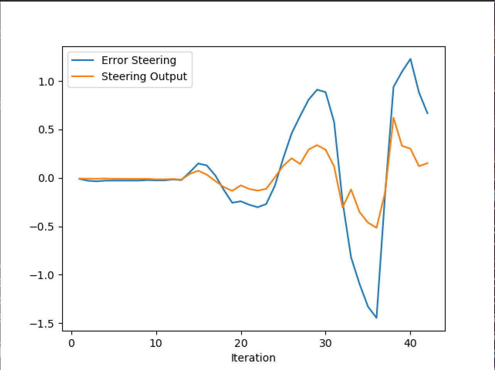|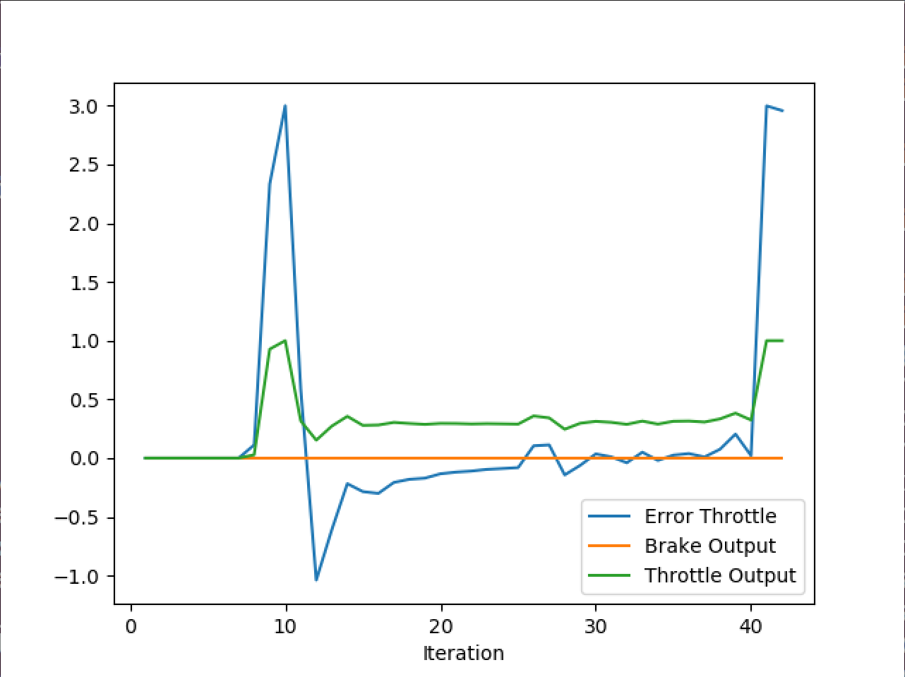|
| <ul><li>Steer: P(0.3), I(0.04), D(0.35)</li><li>P(0.25), I(0.05), D(0.09)</li></ul> |  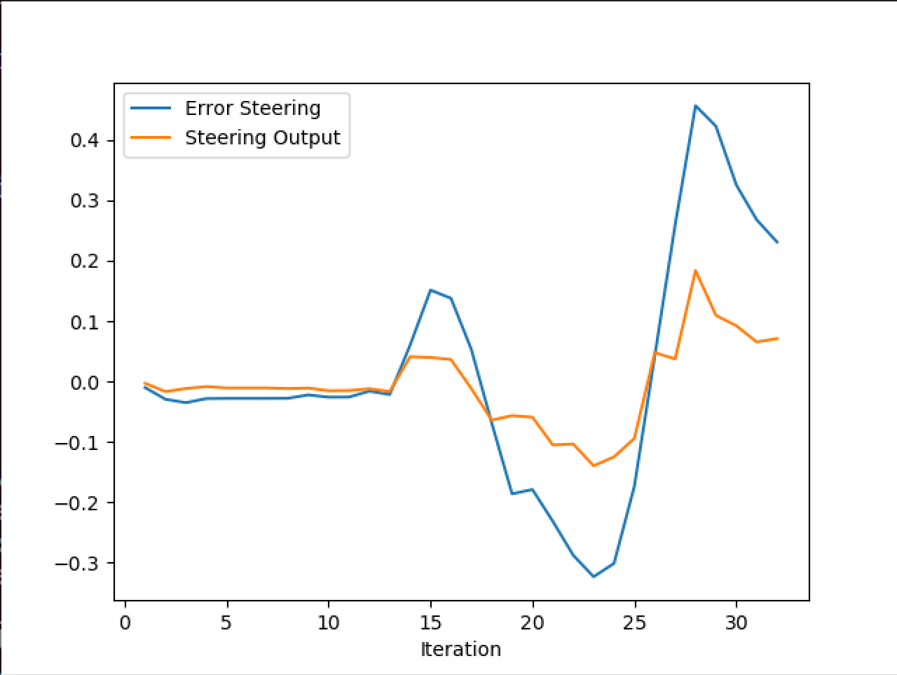|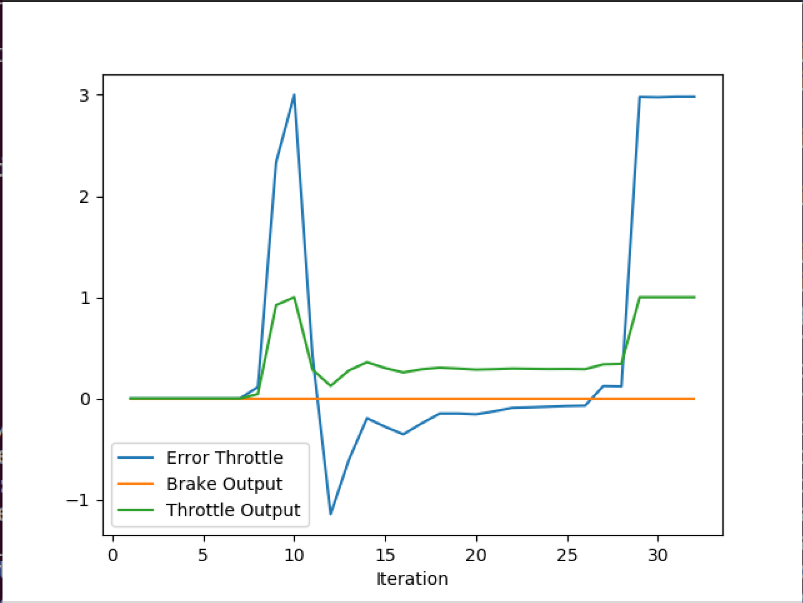|
| <ul><li>Steer: P(0.25), I(0.01), D(0.25)</li><li>P(0.1), I(0.05), D(0.1)</li></ul> |  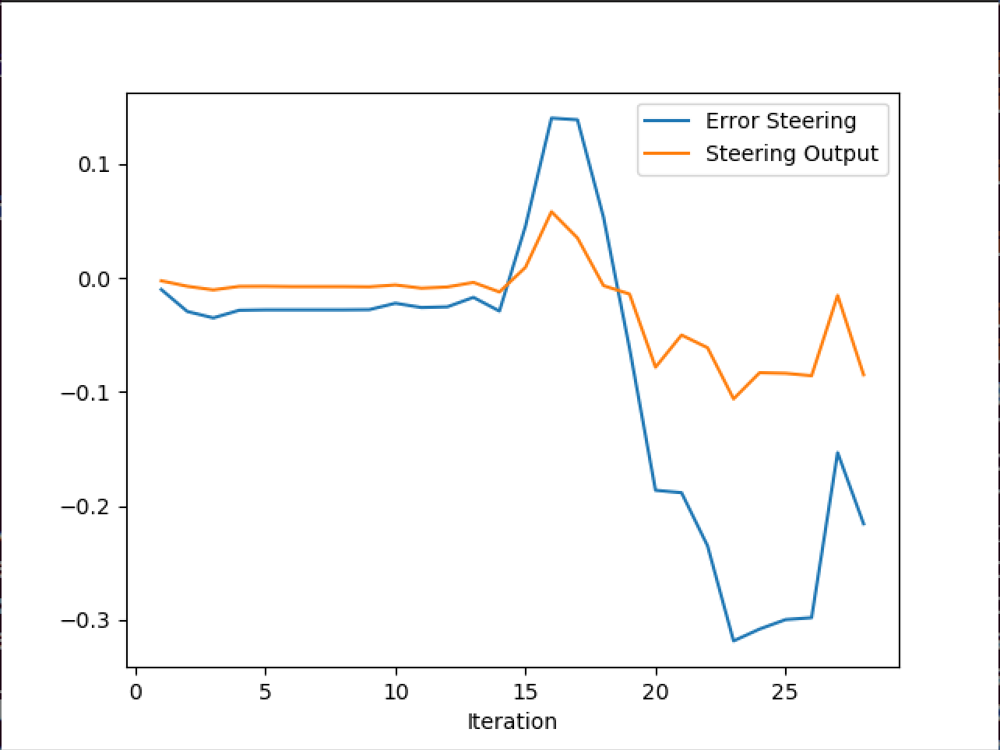|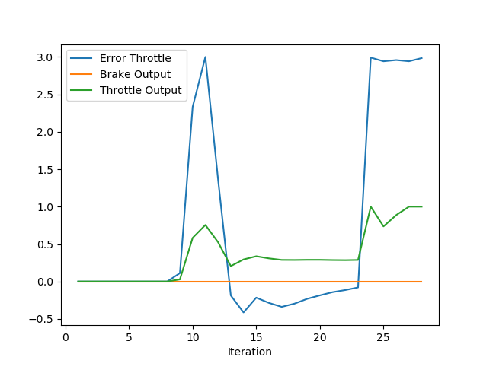|
| <ul><li>Steer: P(0.35), I(0.0012), D(0.9)</li><li>P(0.2), I(0.001), D(0.3)</li></ul>  |  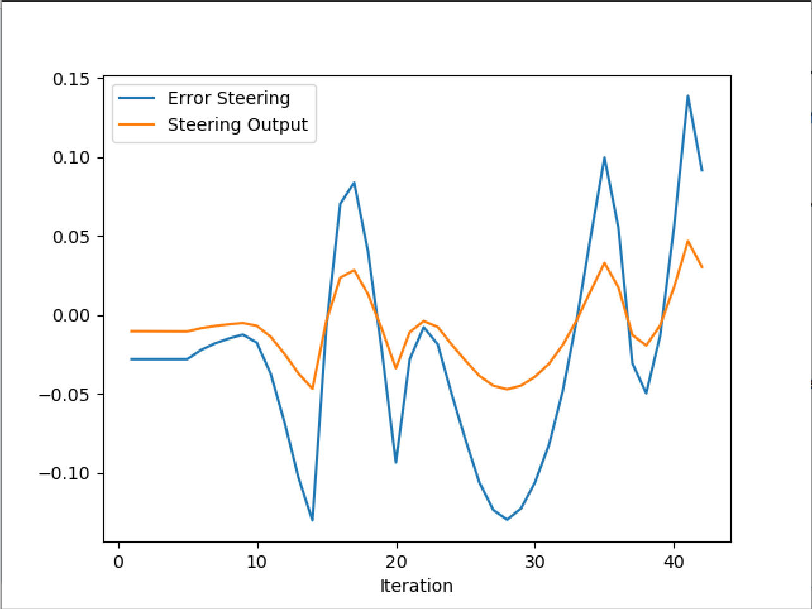|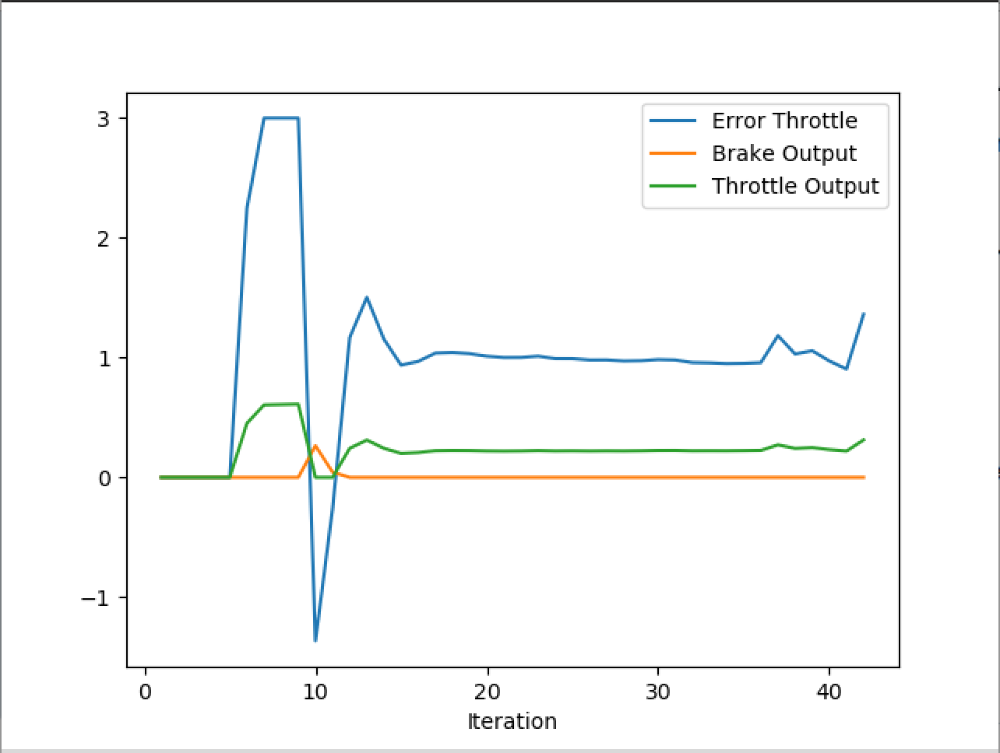|

- By comparing the plots of the reference test with other tests, we can see that increasing K_I and K_D significantly reduces the steer errors and throttle errors.
- From plots of Set 3 and Set 4, we can conclude that increasing K_P of steer control reduces the steer error.
- Throttle control in general is unstable in all conditions.
- Large K_I of throttle results in large throttle error (Set 1 ~ 3). Small K_I around O(1e-3) - O(1e-2) would be ideal (set4).
The best result is in set 4

#### Q2- What is the effect of the PID according to the plots, how does each part of the PID affect the control command?

The proportional gain (Kp) [Amplifies the error signal] determines how much the controller responds to the current error. A high value of Kp will cause the controller to respond more aggressively to the error, but may also cause overshooting and instability.

The integral gain (Ki) [Eliminate steady-state error signal] determines how much the controller responds to the accumulated error over time. A high value of Ki will cause the controller to respond more aggressively to long-term errors, but may also cause instability and oscillation.

The derivative gain (Kd) [Reduce overshoot and oscillations] determines how much the controller responds to the rate of change of the error by adding a term that is proportional to the derivative of the error signal to reduce overshoot and oscillation. but A high value of Kd will cause the controller to respond more aggressively to sudden changes in the error, but may also cause instability and overshooting.

#### Rest of the questions
- Q: How would you design a way to automatically tune the PID parameters?

  A: Using Twiddle as in lessons it will iterate through the code to find the best PID parameters to have minimum error
  
- Q: PID controller is a model-free controller, i.e. it does not use a model of the car. Could you explain the pros and cons of this type of controller?

  A: Pros: it is easy to understand can be used in many systems and doesn't need a model of the system

     Cons: Not so easy to tune and not as accurate as other controllers that use the system model

- Q: (Optional) What would you do to improve the PID controller?
  A: There are some better-tunned parameters by using Twiddle, Ziegler-Nichols method 
